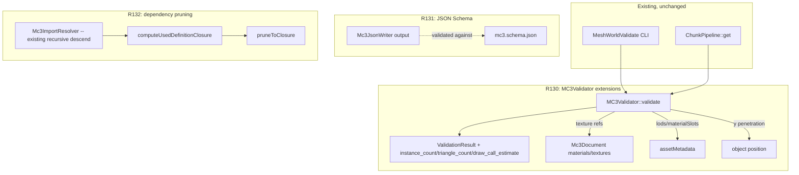

# Study Summary

### Session checkpoint (read this first)

**Per explicit user instruction this pass: R130 is the last task to finish in this iteration. R131 (JSON Schema) and R132 (dependency pruning) must NOT be started until a future session/approval — do not begin any `mesh-craft/mc3` work for them.** R130's own code (R130a + R130b, both sub-parts) is already implemented and verified (see "Progress so far" below) — the **only remaining action to close out this iteration's first stage is the documentation write-up**.

**Audit update (this pass) — the user directly asked "did you actually update NEXT.md/plan.md, and is anything hidden in a Junie-specific directory Claude Code won't know about?". Re-verified by re-inspecting the files, not by trusting memory. Answer: no, the docs were NOT updated yet, and yes, this exact file was the hidden risk.** Concretely confirmed:
- `plan.md` has **zero** `R130` occurrences (grep-confirmed) — no entry exists at all despite the code being done.
- `NEXT.md` still describes **R129** as the most recent change and lists R130 only as an upcoming §8 candidate ("next smallest tasks"), not as landed.
- `CLAUDE.md` is even more stale than `NEXT.md` — it doesn't mention **R129 at all**, still presents "R125-R128 roadmap — fully closed" as the latest checkpoint, and its own "Next destination (not yet scoped/started — ask before picking one)" section actively contradicts reality (R130/R131/R132 were already decided and are mid-flight, two iterations ago).
- **This plan file itself (`.junie/plans/mesh-world-revival-roadmap.md`) is untracked in git** (`git status` shows `?? .junie/`; no `.gitignore` entry excludes it) and is the **only** place the R131/R132 embargo instruction above is written down anywhere in the repository (grep-confirmed: zero hits for "R130"/"R131"/"R132" in `docs/migration-stages.md`, `docs/risk-register.md`, or `CLAUDE.md`). A fresh Claude Code session reading only the git-tracked docs (`CLAUDE.md`/`NEXT.md`) would see R130/R131/R132 listed as one flat 3-item priority sequence with **nothing pausing R131/R132**, and could plausibly start them — unaware of this constraint. Fixing this is now a first-class, explicit requirement of this iteration's doc write-up (see the amended Key Decision 7 below), not an optional nicety: the whole point of `CLAUDE.md`/`NEXT.md` is to be the *self-contained* source a new session needs — a Junie-only plan file must never be the only place a real, active constraint lives.

**Remaining work for this iteration (doc-only, no further code changes needed):**
1. `plan.md`: new dated **R130** entry (R130a+R130b together), matching the existing R125-R129 entry style (deliverable, files touched, tests added, verification command + result).
2. `NEXT.md`: refresh §1 summary paragraph, §2 test-count line, §3 (new "R130 closed" note), §8 (R130 moves from "upcoming" to "landed"; R131/R132 stay listed but now explicitly annotated as paused pending approval) — **and add the R131/R132 embargo as a new §9 "Do not do yet" bullet**, quoting the user's own instruction verbatim.
3. `CLAUDE.md`: bring current — add R129 (missing entirely today) and R130 to its §3 "Current R-series status"/history section, replace the stale "ask before picking one" framing (R130/R131/R132 are no longer unscoped) with the real, already-decided state, **and add the same R131/R132 embargo to its own "Explicitly out of scope right now" list**.
4. `docs/migration-stages.md`: note the §21.2/§21.3-subset/§21.4 closure against R122's own tracking row, and the still-explicitly-deferred cross-chunk/socket-alignment items.
5. `docs/risk-register.md`: no DS item flips yet — DS7 needs R132, not R130.

Only after steps 2-3 land does a future session get an accurate, self-contained picture without needing to discover this Junie-only file. This checkpoint exists so a future session (fresh context, e.g. Claude Code reading `CLAUDE.md`/`NEXT.md`) can resume exactly at "write R130's docs (with the embargo propagated), then decide whether to start R131" without re-deriving any of the investigation below.

### Prior iterations (delivered, verified intact)

Two revival iterations are **done and unchanged**: R125–R128 (taxonomy/containment curation from `object.sqlite3`, `BuildingComposer` extended to `apartment_block`/`shop_street`, city-showcase landmark+LOD), and R129 (the `"zone"` metadata bug fix + `BuildingComposer` extended to `square`, closing Stage 4 of the revival's 7-stage migration strategy completely). `CLAUDE.md` exists as the canonical agent handoff doc. All prior delivery steps and the corresponding `plan.md` R125–R129 entries are `[x]`. `NEXT.md` §8 ("Next smallest tasks") itself already names this iteration's 3 candidates in priority order: **R130** (finish `MC3Validator`'s remaining §21.2/§21.3/§21.4 checks), **R131** (JSON Schema for `mc3.json`, closes Stage 2), **R132** (dependency pruning for standalone-compiled assets, closes `docs/risk-register.md`'s DS7). This iteration builds directly on that state.

### Progress so far (mid-iteration, re-verified this pass)

**R130's code is implemented and independently re-verified, not just carried over from memory:** `include/ValidationResult.hpp` now has `instance_count`/`triangle_count`/`draw_call_estimate`; `src/MC3Validator.cpp` now has `check_asset_metadata()` (materialSlots/lods well-formedness) and `check_materials_and_textures()` (dangling texture-reference detection), plus the `y >= -epsilon` terrain-penetration check (with the documented `material=="water"` exemption for `RiverBankGenerator`/`BridgeGenerator`'s intentionally-recessed water planes); `src/tools/validate_mc3.cpp` prints the new fields. All 34 `MC3ValidatorTests.*` pass; a full rebuild + full-suite run this pass reconfirmed **1631/1634 passing**, with the same 3 pre-existing, run-order-dependent flaky tests already named in `plan.md`'s R125 entry (`ChunkPipelineMapContextTest.IsCityStaysFalseWithoutAnyCityLuaRegistered`, `MapPipelineTest.RealCityLuaAppliesOnlyAtLevel12`, `WorldRendererTests.WithMapLayerLoadsChunksWithoutCrashing`) — re-confirmed unrelated to this iteration (a repeat run showed a *different* passing/failing split with zero code changes in between, the same signature already documented). Also re-verified via `MeshWorldExport --validate --force` against `examples/city_showcase.json`: 0 errors/0 warnings across 9/9 chunks.

**Not yet done, and the concrete remainder of this iteration:** `plan.md` has no R130/R131/R132 entry yet (grep-confirmed), `NEXT.md` §8 still lists all 3 as upcoming rather than R130 as landed, and `docs/migration-stages.md`/`docs/risk-register.md` haven't been touched for this iteration yet. R131 (JSON Schema) and R132 (dependency pruning) have not been started at all in the sibling `mesh-craft` repo (confirmed via `git status` there — only unrelated, concurrent `SYS-W14-13` editor-UI changes are present). The delivery stages below are unchanged in scope from the approved iteration; Stage 1's code is done, its doc write-up is what remains before Stage 2/3 begin.

### What this iteration's investigation found

- **`include/ValidationResult.hpp`/`src/MC3Validator.cpp` confirmed directly**: `ValidationResult` currently has `ok`/`errors`/`warnings`/`generator_id`/`object_count`/`materials_used`/`material_count`/`light_count` only — no `instance_count`/`triangle_count`. `MC3Validator::validate(xml, chunk_size_m)` takes ONE chunk's XML string in isolation; it has no access to neighboring chunks, `Parcel` geometry, or road paths — confirmed by reading the whole file (only `tinyxml2`/`nlohmann::json` includes, single-document recursive `walk()`). This is the concrete basis for the Round-2 scope decision below: genuine cross-chunk checks (building-road intersection, cross-chunk road continuity) would require a real interface change (a new multi-chunk context parameter threading through `ChunkPipeline`/`MeshWorldExport`/`MeshWorldValidate`), not a small addition.
- **`mesh-craft/mc3/include/MeshCraft/Mc3/Mc3AssetMetadata.hpp` confirmed**: `materialSlots` is a flat `vector<string>` of declared slot names (no override mechanism yet to cross-check against), `lods` is `map<string,string>` (tier → definition id, already used by R128's `BuildingComposer::resolve_instance_id()`), `sockets` is `map<string,array<float,3>>`. `Mc3XmlWriter.cpp`/`Mc3XmlParser.cpp` confirmed: `assetMetadata` (including `lods`) round-trips as a `<definition><assetMetadata><lods>...</lods></assetMetadata></definition>` child — genuinely present in exported XML, not just an in-memory struct.
- **`src/Mc3DocumentBuilder.cpp`'s `add_material()` confirmed**: whenever a `MaterialEntry` has a non-empty `texture_uri`, it sets `mat.baseColorTexture = texture_uri` AND registers `doc_->textures[texture_uri]` in the same call — so mesh-world's own generated content is self-consistent today, but a validator check is still a real regression guard (hand-authored/imported content, or a future bug in this exact symmetry, would otherwise go uncaught). `mesh-craft/mc3/src/Mc3XmlWriter.cpp` confirms the XML shape: `<textures><texture id="..."/></textures>` and `<materials><material base_color_texture="..." normal_texture="..." .../></materials>` — both parseable by the same `tinyxml2` recursive walk `MC3Validator` already uses.
- **`src/ChunkPipeline.cpp:306` confirmed**: `triangle_count` is already computed today via `Mc3MeshBuilder{}.build(content).total_triangles()`, but only inside `ChunkPipeline::get()` for `ChunkDiagnostics` — `MC3Validator`/`MeshWorldValidate` (`src/tools/validate_mc3.cpp`) have no triangle count at all today, requiring a second, separate pass by any caller that wants both.
- **`mesh-craft/mc3/include/MeshCraft/Mc3/Mc3ImportResolver.hpp`'s own doc comment confirmed**: `resolve()` only returns direct-import definitions; a resolved library's own further imports are walked recursively for **cycle-detection only**, never merged. Its own words: "Standalone-compile dependency pruning — computing the minimal set of transitively-used definitions for a compiled asset — is explicitly R110's deferred follow-up, not this class's job" — confirming no such closure-computation code exists anywhere yet. `Mc3Document::definitions` is `map<string, shared_ptr<Mc3Object>>`, and a definition's own body can itself place further `<instance>` elements (composite objects) — the recursive structure R132's closure-walk needs already exists to walk, just not a pruning algorithm over it.
- **`docs/migration-stages.md` Stage 2 confirmed**: `| add JSON Schema | R109 explicitly deferred this | **not started** |` is the one remaining open line in an otherwise-`done` stage — R131 closes Stage 2 completely.
- **`docs/risk-register.md` DS7 confirmed**: `- [ ] DS7 Standalone-compiled assets include only their required dependencies (R110/R119 dependency pruning), not the whole library.` — directly what R132 closes.
- **Cross-repo coordination risk confirmed real, not hypothetical**: `mesh-craft`'s own `plan.md` shows active, independent editor-UI work (`SYS-W14-13`, dated the same day as this session) touching `Mc3Document::library`/`imports`/`assetMetadata` fields R131/R132 also touch — R131/R132 must add to these types, not restructure them, to avoid conflicting with that sibling work (same precedent `mesh-craft`'s own SYS-W14-13 entry used when it checked mesh-world's status before proceeding).

# Strategic Direction

### What this iteration closes

 Stage / gap | Status before this iteration | This iteration |
---|---|---|
 Stage 2 (shared `mc3.json`/import foundations) | Done except the JSON Schema file (R109 deferred it) | **R131 closes it completely** |
 Stage 4 (city showcase) | Fully closed already by R113/R126/R127/R128/R129 | unchanged, not touched again |
 `MC3Validator`/§21 tooling (R122) | Only §21.2 "finite transform values" done | **R130 closes the single-chunk-computable remainder** of §21.2/§21.3/§21.4 |
 `docs/risk-register.md` DS7 (dependency pruning) | Open, deferred by R110 | **R132 closes it** |

This iteration does not advance a migration-strategy stage the way R125–R129 did — Stage 4 is already fully closed. Instead it closes the **validation-tooling and format-completeness follow-ups** that R109/R110/R122 each explicitly deferred, exactly the 3 items `NEXT.md` §8 lists as the current priority order. Per the user's Round-2 decision, R130's spatial-validation slice is deliberately bounded to what a single chunk's own XML can answer — genuine cross-chunk checks (building-road intersection, cross-chunk road continuity) and socket/cave-connection alignment (no non-trivial-socket content is actually composed into a chunk yet — R112's window/door/roof/facade-module assets remain "registered but unplaced", blocked on the out-of-scope R104 script engine) are explicitly deferred to a future task once a real multi-chunk validation design exists.

### Explicitly out of scope for this iteration (and why)

- **Cross-chunk spatial checks** (building-road intersection, cross-chunk road continuity) — would require a new interface (a multi-chunk/neighbor-aware context) threading through `MC3Validator`, `ChunkPipeline`, `MeshWorldExport`, and `MeshWorldValidate`; deferred per your Round-2 choice to a future, separately-scoped task.
- **Socket-alignment / cave-connection-alignment checks** — no chunk in the codebase today actually composes content with non-trivial sockets (R112's socket-based window/door/roof/facade-module content needs the out-of-scope R104 script engine to attach), so there is nothing real to validate against yet; same reasoning R111 already used to defer this.
- **Shadow-caster counts / LOD-reduction-ratio metrics** (§21.4) — both need `assetMetadata` fields (`shadowPolicy`, `lods` target geometry) that live on externally-injected library definitions, not inline in mesh-world's own per-chunk exported XML (which mostly consists of `<instance>` placements) — not meaningfully computable from what a single exported chunk document actually contains.
- **R104** (MeshCraft `<script>` engine execution) — still needs separate cross-repo sign-off; not requested here.
- **R115** (AI content factory), **R116–R118** (nature/mountains/caves), **R120** (PBR/rendering) — all correctly sequenced *after* Stage 4/validation-tooling closure per the revival doc's own risk analysis.
- **Visual/screenshot review** (`docs/risk-register.md` DS2/DS4) — needs a human with a real display; this sandboxed, GPU-less environment cannot perform it, same limitation already documented for R128/R129.

# Technical Design

### Current Implementation (grounding)

```
MC3Validator::validate(xml, chunk_size_m)              (src/MC3Validator.cpp)
  -- single-document recursive walk(), NO cross-chunk data, NO Parcel/road geometry
  check_object(): id, position x/z bounds, rotation/scale (finite, R122), material
                  (registered? -- warning only, against MeshWorld::MaterialRegistry)
  -> ValidationResult { ok, errors, warnings, generator_id,
                        object_count, materials_used, material_count, light_count }
     -- no instance_count, no triangle_count, no material-slot/texture/LOD checks

Mc3Document (mesh-craft/mc3)
  .materials[id]  -> Mc3Material { baseColorTexture, normalTexture, ... }  (string keys)
  .textures[id]   -> Mc3Texture                                            (string keys)
  .definitions[id]-> shared_ptr<Mc3Object> { assetMetadata? { materialSlots, lods, sockets } }
  -- <definition><assetMetadata><lods><lod tier="..." definition="..."/></lods></assetMetadata>
     already round-trips through Mc3XmlWriter/Mc3XmlParser (R111); genuinely present in
     mesh-world's own exported chunk XML, not just an in-memory struct.

Mc3ImportResolver::resolve()      (mesh-craft/mc3, R101)
  -- direct imports only; recurses further imports for CYCLE DETECTION ONLY, never merges
  -- own doc comment: standalone-compile dependency pruning explicitly NOT this class's job
```

`src/tools/validate_mc3.cpp` (`MeshWorldValidate`) is the standalone CLI wrapping `MC3Validator::validate()` — the natural place to also print the new performance-metric fields this iteration adds.

### Key Decisions

1. **R130's spatial-check scope is single-chunk-computable only** (your Round-2 choice). `MC3Validator::validate(xml, chunk_size_m)` keeps its existing `(string, float)` signature — no new multi-chunk/neighbor-context parameter this iteration. Concretely in scope: terrain penetration (extend `check_object()`'s existing x/z bounds check with a `y >= -epsilon` check, the natural extension of a check that already exists for x/z) and the already-existing out-of-bounds check (kept, not re-architected). Building-road intersection, cross-chunk road continuity, and socket/cave-connection alignment are deferred (see Strategic Direction).
2. **Material-slot/texture/LOD checks are purely document-internal cross-references, not placeholders.** "Valid texture references": every non-empty `Mc3Material::baseColorTexture`/`normalTexture`/`emissiveTexture`/`metallicRoughnessTexture`/`occlusionTexture` must match a key in the same document's `<textures>` section (mirrors `Mc3DocumentBuilder::add_material()`'s own existing self-consistency, now enforced as a regression guard against hand-authored/imported content). "Valid LOD mappings": each `assetMetadata.lods` entry needs a non-empty tier name and definition id; if that definition id is present in the SAME document, it must actually resolve (not dangling) — mirroring the existing `<instance definition="...">` precedent that deliberately skips resolution when the target is known to live in an externally-injected library. "Valid material slots": `materialSlots` entries must be non-empty/non-duplicate (no slot-override authoring mechanism exists yet to cross-check bindings against, so this is a well-formedness check, not a binding-validity check — documented honestly as such, not oversold).
3. **Performance metrics (§21.4) extend `ValidationResult`, not a new parallel struct.** New fields: `instance_count` (a `<instance>`-only count, split out of the existing generic `object_count`) and `triangle_count` (reusing the exact same `Mc3MeshBuilder{}.build(content).total_triangles()` call `ChunkPipeline::get()` already makes at src/ChunkPipeline.cpp:306, so `MC3Validator`/`MeshWorldValidate` report it directly instead of requiring a second pass). `draw_call_estimate` is defined conservatively as equal to `object_count` (1 draw call per placed object — `WorldRenderer.cpp` doesn't batch or instance today) with an explicit doc comment flagging it as a placeholder pending R120's GPU-driven rendering work, not a real batching-aware estimate. Shadow-caster counts and LOD-reduction ratios are explicitly NOT added (see Strategic Direction's out-of-scope list).
4. **R131's JSON Schema targets the actual `Mc3JsonWriter` output shape**, verified self-consistent against the existing round-trip fixtures (the hand-built full-AST fixture and `RandomMc3DocumentGenerator`'s 60 random documents in `mc3/test/json_roundtrip_test.cpp`) rather than a hand-guessed shape. A schema-validation library (e.g. `pboettch/json-schema-validator`, evaluated at implementation time) is added as a new `FetchContent` dependency in `mc3/CMakeLists.txt`, mirroring R109's own precedent of adding `nlohmann/json` itself the same way for exactly this kind of need. New ctest target validates every existing JSON fixture against the schema.
5. **R132's dependency pruning extends `Mc3ImportResolver`'s existing recursive-descend logic, not a second graph-walk implementation.** A new `computeUsedDefinitionClosure(doc, rootInstanceIds)` walks `doc.objects`' placed `<instance definition="...">` references, recursing into each referenced definition's own body (a definition can itself place further `<instance>`s — composite objects) to compute the full transitive closure of definition ids actually reachable. A `pruneToClosure(doc, closure)` then drops unused `definitions`/`materials`/`textures` entries, producing a minimal standalone document. Both are additive: they do not change `Mc3Document`'s existing fields/shape, so they cannot conflict with `mesh-craft`'s own concurrent `SYS-W14-13` editor-UI work on `library`/`imports`/`assetMetadata` (Study Summary).
6. **Continue the project's own numbering/documentation convention**: `plan.md` gets new **R130**/**R131**/**R132** entries (mesh-world's `plan.md` stays the authoritative R-series log even though R131/R132's code lands in `mesh-craft/mc3`, exactly like R109/R110/R111 already did), each following the exact per-task write-up style (deliverable, files touched, tests added, verification command run).
7. **Any explicit user instruction that pauses/embargoes a task (e.g. "do not start R131/R132 yet") must be mirrored into the git-tracked handoff docs (`NEXT.md` §9 "Do not do yet", `CLAUDE.md`'s "Explicitly out of scope right now"), not left recorded only in this Junie-specific plan file.** This plan file is a useful mid-iteration scratchpad and cannot be assumed to be read by a future session (it is untracked in git and has no pointer from `CLAUDE.md`/`NEXT.md`) — any constraint that must survive into a future clean-context session has to live in the files that session is actually told to read first.

### Proposed Changes

**R130a — §21.2 remainder (material-slot, texture-reference, LOD-mapping validity)**
- `src/MC3Validator.cpp`: extend `check_object()`/`walk()` to also parse `<materials>/<material>` and `<textures>/<texture>` sections and validate `base_color_texture`/`normal_texture`/`emissive_texture`/`metallic_roughness_texture`/`occlusion_texture` references against declared `<texture id="...">` entries; parse `<definition><assetMetadata>` blocks for `materialSlots` (non-empty/non-duplicate) and `lods` (non-empty tier+definition id; resolve when the target definition is present in the same document).
- `include/ValidationResult.hpp`: no new top-level fields needed for this slice — new errors/warnings feed the existing `errors`/`warnings` vectors.
- New tests in `tests/MC3ValidatorTests.cpp`: dangling texture reference, valid self-consistent material+texture pair (mirrors `Mc3DocumentBuilder::add_material()`'s real output), malformed/duplicate `materialSlots`, dangling vs. valid `lods` entries.
- `plan.md`: new **R130** entry recording this slice plus R130b below.

**R130b — single-chunk spatial checks + performance metrics (§21.3 subset + §21.4)**
- `src/MC3Validator.cpp`: extend `check_object()`'s position check with a `y >= -epsilon` terrain-penetration check (same style as the existing x/z bounds check).
- `include/ValidationResult.hpp`: add `instance_count` (count of `<instance>` elements specifically) and `triangle_count` (via `Mc3MeshBuilder`, reusing the exact computation `ChunkPipeline::get()` already does) and `draw_call_estimate` (documented as `== object_count` for now, a placeholder pending R120).
- `src/tools/validate_mc3.cpp` (`MeshWorldValidate`): print the new fields in its per-file `OK`/summary output.
- New tests in `tests/MC3ValidatorTests.cpp` covering the y-penetration check and the new count fields; verified via `MeshWorldValidate` against real exported chunks from `examples/city_showcase.json`.
- `docs/migration-stages.md`/`plan.md` updated noting the remaining, explicitly-deferred §21.3 items (building-road intersection, cross-chunk continuity, socket/cave alignment).
- `NEXT.md` §1/§2/§3/§8 refreshed to report R130 as landed (not upcoming), plus a new §9 "Do not do yet" bullet recording the R131/R132 embargo verbatim. `CLAUDE.md` §3/§4 refreshed the same way (also backfilling the missing R129 entry), with the same embargo bullet added to its own out-of-scope list — see Key Decision 7 and the Session checkpoint's "Remaining work" list for the exact wording/placement.

**R131 — JSON Schema for `mc3.json`**
- New `mc3.schema.json` in `mesh-craft/mc3` describing the `Mc3JsonWriter` output shape (metadata, environment/fog, lights, cameras, textures, materials, embeds, scripts, sounds, music, triggers, scene states, definitions/instances with variants, primitives, extrude, CSG, groups/deform/uvMapping, library/imports (R110), assetMetadata (R111)).
- `mc3/CMakeLists.txt`: evaluate and add a schema-validation library (e.g. `pboettch/json-schema-validator`) as a new `FetchContent` dependency, mirroring R109's own `nlohmann/json` precedent.
- New `mc3/test/json_schema_test.cpp` (registered as a ctest target): validates the hand-built full-AST fixture and `RandomMc3DocumentGenerator`'s random documents (same fixtures `json_roundtrip_test.cpp` already uses) against the schema.
- `docs/migration-stages.md`: flip Stage 2's "add JSON Schema" row from "not started" to "done", closing Stage 2 completely. `plan.md`: new **R131** entry.

**R132 — dependency pruning for standalone-compiled assets**
- `mesh-craft/mc3`: new `Mc3Document::computeUsedDefinitionClosure(rootInstanceIds)` (walks placed `<instance>` references recursively, including nested instances inside composite definitions) and `Mc3Document::pruneToClosure(closure)` (drops unused `definitions`/`materials`/`textures`), extending `Mc3ImportResolver`'s existing recursive-descend logic rather than duplicating it.
- New `mc3/test/dependency_pruning_test.cpp` (ctest target): a document with used + deliberately-unused definitions/materials/textures prunes to exactly the expected closure; round-trips correctly afterward (XML and JSON).
- `docs/risk-register.md`: tick **DS7** once verified. `plan.md`: new **R132** entry.

### Architecture Diagram



### Risks (cross-referenced, not duplicated)

- **Cross-repo coordination** (Study Summary): R131/R132 land in `mesh-craft/mc3`, which has its own concurrent, independent editor-UI work (`SYS-W14-13`) touching related types — mitigated by keeping R131/R132 strictly additive (new methods/files), never restructuring `Mc3Document`'s existing fields.
- **RR1/RR2** (`docs/risk-register.md`): new validator errors must not turn existing, already-shipped content (R125–R129) into false failures — every new check is verified against real exported chunks from `examples/city_showcase.json` (which already exercises apartment/shop/square/landmark content) before being considered done.
- **Scope-creep risk on R130**: the single-chunk-only boundary (Key Decision 1) must be respected in the implementation, not silently expanded into a bigger interface change — any temptation to add a neighbor-context parameter to `MC3Validator::validate()` should stop and re-scope as a separate task instead.
- **R131 dependency risk**: adding a schema-validation library is a new third-party dependency — if no well-maintained C++ option turns out feasible at implementation time, fall back to a schema file with self-validated fixtures only (no runtime enforcement wiring), rather than blocking the whole task on dependency availability.
- **Documentation-drift risk (confirmed real this pass, not hypothetical)**: R130's code landed before its docs did, and the R131/R132 embargo instruction existed only in this untracked, Junie-only plan file — exactly the failure mode a fresh Claude Code session would hit. Mitigated going forward by Key Decision 7: every explicit pause/embargo instruction gets mirrored into `NEXT.md`/`CLAUDE.md` in the SAME delivery step that lands the code it applies to, not deferred to a later "catch-up" pass.