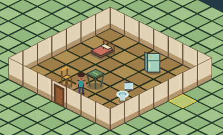

# wolf-cna

An original retro first-person shooter prototype written in **C++23** and rendered as **real polygonal 3D through CNA**.

This starter is deliberately small. It proves the basic direction before local AI agents continue the project.



## What already works

- CNA `Game` startup
- true 3D triangle world
- `VertexBuffer` / `IndexBuffer`
- `BasicEffect`
- depth testing
- CNA-loaded original stone, brick, steel, laboratory and wood materials combined with generated floor, ceiling and door panels in one texture atlas
- first-person camera
- classic arrow-key movement plus normalized `A`/`D` strafing
- configurable keyboard turning with a fixed horizon and five persisted speed levels
- crosshair-free play view with a large original AI-generated knife, sidearm, repeater or heavy automatic sprite in the lower center
- discoverable repeater and heavy automatic weapon with distinct first-person sprites and matching HUD icons
- full-width blue HUD keeps `LEVEL`, `SCORE`, `LIVES`, `HEALTH%`, `AMMO` and the final weapon icon in order, with independent cyan/amber card indicators and an original animated player-status portrait
- explicit weapon profiles give knife, sidearm, repeater and heavy automatic distinct range, damage, spread and cadence; firearm damage falls with distance and movement widens deterministic seeded spread
- every weapon has an original dedicated slash/firing frame, combined with visible knife lunge or firearm recoil for immediate attack feedback
- clearly audible generated CNA effects for firearm shots, knife attacks, ammunition, enemy alerts and attacks, defeated enemies, doors, locks and player damage; every ranged archetype has its own alert and attack timbre
- five original generated music tracks, one per sector, each a sixteen-bar loop with its own key, tempo, chord walk and lead figure over the bunker drone, the second half varying the figure rather than repeating it; five master-volume levels in the title menu
- a persisted 60/72/84/96-degree view-angle choice in the title menu
- uncapped run score for treasure, defeated enemies, secrets and deterministic sector bonuses; every 40,000 points awards another life
- a centered completion card shows kill, treasure and secret percentages plus clear, target-time and perfect-category awards
- grid collision with wall sliding
- full-cell polygonal push walls slide away from the player by up to two safe cells, pause before overlapping actors and permanently expose their passage
- level loaded from a validated text file
- sectors follow the 1992 room-and-door grammar: 39-41% open floor carved into many small rooms joined by 45-56 doors each, laid out by `tools/generate_sector.py` and accepted only when every sector audit passes
- a short `GEAR UP` screen with a filling bar announces each sector's chapter, name and code before play begins
- `PROCEDURAL RUN` builds an endless sequence of sectors at run time from a seed and a depth, each accepted only after passing the same invariants the authored sectors are audited against; deeper sectors carry more enemies and less ammunition, five themes rotate with their own music and palette, every fifth floor is a Warden encounter, and the run can be saved and resumed
- five progressively unlocked authored bunker sectors plus a discoverable hidden sector, deterministic return route, original boss encounter and campaign-ending screen
- original transparent pixel-art guard, hound, rapid-trooper, heavy-unit and Bunker Warden sprites rendered as camera-facing polygons in the 3D world
- idle enemies breathe subtly, while chasing enemies use faster archetype-specific step bob and sway
- unaware enemies use directional sight, archetype-specific reaction delays, connected-route hearing and authored patrol arrows; lowercase enemy symbols create noise-ignoring ambush encounters
- alerted enemies remember the last seen or heard position, search it and can open ordinary doors without bypassing security locks
- every enemy uses a brief dedicated firing/lunge sprite synchronized with its actual attack event
- every surviving enemy briefly switches to its own non-gory recoil pose when hit
- every defeated enemy switches to its own original collapsed/resting sprite above a stylized procedurally textured blood-pool decal
- authored rooms include procedural framed paintings, peace-symbol banners, ceiling lamps with warm floor-light pools, wood-textured polygonal tables and three sector-specific freestanding plant landmarks
- eleven original solid bunker props — steel drum, water cistern, supply crates, floor lamp, ration tins, valve assembly, laboratory bench, equipment rack, empty pressure suit, archive cabinet and a rubble pile — block the player and enemies like the authored tables, placed seven per sector by theme
- room-scale wall regions use four original generated material families: cool bunker stone, dark industrial brick, teal riveted steel and cold laboratory panels
- only the nearest eligible ranged enemy fires at one time; guards, rapid troopers and heavy units use slower distinct cadences while hounds remain close-range attackers
- the original Bunker Warden boss has a dedicated health bar, 48-point base health, four generated visual states and a deterministic three-projectile fan attack
- optional relay and terminal state never blocks an elevator; only the Warden Core's explicit boss lockdown holds its final elevator until the Warden is defeated
- defeated guards, rapid troopers and heavy units drop difficulty-scaled ammunition; hounds do not drop ammunition
- two health sizes, ammunition, four treasure tiers, cyan/amber access cards, a rare recovery beacon and both weapon pickups use original transparent pixel-art sprites instead of colored blocks
- terminals, power relays, sector exits and enemy projectiles use original transparent sprites with readable state tinting instead of colored cuboids
- health kits remain in the level at 100% health and can be collected after the player takes damage
- every sector provides at least two health kits, while the knife fallback keeps a deterministic full clear possible at every ammunition budget
- no external copyrighted game assets
- original title menu with the classic four deterministic difficulty rungs — Scout, Operative, Veteran and Phantom — changing enemy count, health, speed, firing cadence, reaction delay, hearing range, how many enemies may fire at once, incoming damage and ammunition supply
- illustrated splash with a generated original bunker background and a large sharp `WOLF CNA` heading before the separate main menu
- persistent profile: a fresh profile starts with sector 1; sector unlocks, master volume, view angle, last selected difficulty, validated controls and the best eight campaign scores survive restarts
- three versioned in-run save slots preserve the player, both access colors, inventory, score, lives, sector time, enemies and AI state, pickups, doors, projectiles, objectives and explored automap; the title and pause menus can load them
- a compass above the HUD bears on the elevator's approach — the side it can actually be used from — and shows the distance in cells; it points but never reveals the route, and the automap already marks the same goal
- holding the map key (`Tab` by default) shows a paused floor map that reveals only visited cells while always marking the sector exit as `GOAL`
- every `GOAL` corresponds to a steel elevator cabin whose side-retracted gate allows immediate Wolf-like action activation or physical entry

## Controls

- up/down arrow keys or `W` / `S`: forward / backward
- `A` / `D`: strafe left / right; diagonal movement is normalized to the same maximum speed
- every action has an optional secondary key, which is how `W` / `S` complete the WASD layout without taking the classic arrows away
- hold left or right `Shift` while moving: run at 165% speed
- left/right arrow keys: turn left / right
- mouse: turn left / right with a fixed horizon; the left button attacks, the middle button activates and the right button is the classic strafe modifier, which sidesteps with the turn keys and horizontal mouse travel instead of rotating
- optional classic vertical axis: pushing the mouse away walks forward and pulling it back walks backward, at twice the horizontal gain as in 1992; it is off by default
- the cursor is captured only during live gameplay and is released for every menu, so `Escape` into the pause menu always frees it; keyboard turning stays available whether the mouse is on or off
- title/sector/difficulty menus: arrows select, `Enter` or `Space` confirms, `Escape` backs out; the title menu cycles master volume through 0/25/50/75/100% and view angle through 60/72/84/96 degrees
- `CONTROLS`: rebind forward/back, turning, strafing, run, action, attack and map; assigning an occupied key swaps the two actions, claiming a key that is some action's secondary releases it there, reserved menu/system keys are rejected, and `RESTORE DEFAULTS` restores the classic layout
- each row shows `PRIMARY / SECONDARY` when the action has both
- control setup also offers 70/85/100/115/130% keyboard turn speed; left/right and `Enter` change it
- `MOUSE SETUP` is its own screen: mouse on/off, 40/70/100/130/160% mouse speed, the vertical axis, and an assignable action for each of the three buttons — none, attack, strafe, use or run — mirroring the original's `buttonmouse[]`
- high-score initials: up/down changes the selected letter, left/right selects one of three positions and `Enter` saves
- four difficulty rungs: Scout has fewer, weaker and slower enemies, more ammunition, a fourth life and 130% health kits; Operative is the baseline; Veteran adds reinforcements, health, speed and firing frequency while cutting ammunition and health kits and applying 130% incoming damage; Phantom faces the whole authored roster, hits at 160%, reacts far sooner, hears further, lets a third enemy fire at once and allows only two lives with 70% health kits
- `Space`: open the door in front of you, deliberately close a fully open ordinary door, or activate a faced sector elevator (doors close after four seconds unless the player, an enemy or a body blocks them)
- left or right `Ctrl`: attack with the selected weapon; hold for repeater/heavy automatic fire, while the knife and sidearm fire once per press; empty firearms automatically fall back to the knife
- `1` / `2` / `3` / `4`: knife / sidearm / repeater / heavy automatic; weapons 3 and 4 must be found first, and each automatic projectile consumes exactly one round
- collecting ammunition after reaching zero restores the last firearm automatically
- `F11`: toggle fullscreen
- the pause menu cycles `VIEW SIZE` through five steps; the smaller ones shrink the 3D window inside the area above the HUD and leave the classic border, and the weapon scales and sits with that window
- `P` or `Escape`: open the in-run pause menu; either key resumes directly, while the menu can also change sound/view settings or return to the title
- `F8`: safely save the current run to the selected slot through a temporary file
- `F9`: quick-load the selected slot; the pause and title menus also select, save and load slots 1–3
- hold the configured map key (`Tab` by default): show the explored-area map; releasing it resumes play; it includes a marker legend, optional `POWER`/`TERMINAL` progress and an always-cyan `GOAL`
- quitting the application is an explicit `QUIT` choice in the main menu
- `I` + `L` + `M` together: retro loadout cheat — full health, all weapons,
  both access cards, heavy automatic selected, ammunition set to 99, and score reset to zero
- `G` + `O` + `A` + `L` together: teleport to the free cell immediately outside
  the current sector elevator and face its doors; objective state is unchanged

After all lives are lost, press the configured action key (`Space` by default) to
return to the title menu and start a new run.
Before that final game over, losing a life shows a short `LIFE LOST` transition and
restarts the current sector from its authored state: enemies, pickups, doors,
objectives, secrets and automap reset; score returns to its sector-entry value and
the player receives full health, knife, sidearm and the difficulty's starting ammo.
At a standard sector exit, the configured action key takes the run to the next sector;
score, lives, health, ammunition and the selected weapon carry forward, while both
sector access cards reset.
The foundry also hides a three-sided `X` elevator behind a moving secret wall. It
branches to the Hidden Reservoir and its standard elevator returns to the Labs,
without exposing the hidden sector in the normal sector-selection menu.
Before the transition, the game shows kill, treasure and secret percentages. Every
clear awards 1,000 points, each perfect category awards 1,500, and every whole
second below the sector's authored target awards 20. Individual enemy, treasure and
secret scores still accumulate normally, and all awards continue to feed extra lives.
After the campaign finale, a qualifying score enters three initials and joins a
validated, descending table of the best eight results shown on the ending screen.
Unlocked sectors and high scores are stored in `wolf-cna-progress.dat` in the launch
working directory. Invalid progress data safely falls back to sector 1 with an empty
score table; profile versions 1–9 migrate into the current version 10 format. Each
version appends to the previous one, so an older profile keeps every setting it
stored and adopts the defaults for whatever it predates.
Run slots are stored as `wolf-cna-save-1.dat` through `wolf-cna-save-3.dat`.
Malformed, incompatible or sector-mismatched saves are rejected without replacing
the current run. The current run-save version 6 persists the procedural run's seed and depth, push-wall direction, travel
and the deterministic combat-shot sequence while migrating versions 1–4.

## Level files

The campaign uses [`assets/levels/starter.level`](assets/levels/starter.level),
[`assets/levels/sector-02.level`](assets/levels/sector-02.level),
[`assets/levels/sector-03.level`](assets/levels/sector-03.level) and
[`assets/levels/sector-04.level`](assets/levels/sector-04.level), plus the hidden
[`assets/levels/hidden-reservoir.level`](assets/levels/hidden-reservoir.level) and
boss [`assets/levels/warden-core.level`](assets/levels/warden-core.level). They use larger
rooms connected by corridors rather than a single continuous maze. Each row must
have the same width and use only these symbols:

- `#`: solid wall
- `.`: empty floor
- `P`: the single player spawn
- `D`: closed sliding door
- `Q`: closed cyan-access security door
- `q`: closed amber-access security door with its own amber atlas panel
- `C`: cyan security-card pickup, required to open `Q`
- `c`: amber access-card pickup, required to open `q`
- `M`: optional amber bunker terminal
- `O`: optional violet power relay
- `S`: secret full-cell push wall; approach it from a walkable side and use the action key to move it into one or two adjacent `.` cells
- `G`: guard spawn
- `K`: hound spawn
- `F`: rapid-fire trooper spawn
- `U`: heavy-unit spawn
- `Z`: original Bunker Warden boss spawn
- `g` / `k` / `f` / `u`: matching ambush enemy, initially facing away from the player spawn and ignoring weapon noise until it sees, touches or is hit by the player
- `^` / `>` / `v` / `<`: invisible logical patrol direction; place the first marker next to an uppercase enemy and keep its destination walkable
- `H`: large health kit worth up to 25 health
- `h`: small field dressing worth up to 10 health
- `A`: large ammunition pickup worth 8 Operative rounds
- `a`: small ammunition pickup worth 4 Operative rounds
- `T`: gold-bars pickup worth 100 score
- `J`: golden-goblet pickup worth 250 score
- `N`: peace-medallion pickup worth 500 score
- `p`: peace-prism pickup worth 1,000 score
- `r`: rare recovery beacon that restores 100% health and grants one life
- `E`: steel elevator cabin and level exit; shipping levels enclose it on three sides
- `X`: hidden-sector elevator; it looks like an ordinary exit but follows the sector metadata's secret route
- `R`: wall-mounted framed landscape painting; must be next to a wall
- `B`: wall-mounted banner with an original peace symbol; must be next to a wall
- `I`: freestanding decorative plant using the current sector's original sprite
- `L`: ceiling lamp
- `W`: repeater weapon pickup with 8 Operative rounds
- `V`: heavy automatic weapon pickup with 14 Operative rounds
- `Y`: solid freestanding polygonal table using an original dark-oak material

The loader rejects malformed rows, unknown symbols, and levels without exactly one player spawn.
It also rejects patrol arrows that point directly into a wall or another blocked cell.
Enemy symbols remain authored encounter positions. Their stable row-major encounter
tier determines whether they appear on Scout, Operative or Veteran, so selecting a
difficulty never introduces random or unauthored spawn locations.

Fixed ammunition and weapon-pickup values scale with difficulty. Defeated guards,
rapid troopers, heavy units and the Warden have distinct base drops; those drops also
increase for a carried repeater or heavy automatic. Shared ammunition never exceeds
99, full ammo pickups remain in place, and duplicate weapons convert to their listed
ammunition value instead of re-awarding ownership. Health items likewise remain when
health is already 100%.

An elevator is available from the beginning of a sector. Its gate starts retracted sideways,
and entering the cabin or pressing `Space` while facing it completes the sector.
Ordinary, access and elevator door panels stay at floor height and slide horizontally
into an adjacent wall pocket; they never rise through the ceiling. Doorways with two
valid pockets alternate their opening direction, while one-sided doors always retract
into the wall that is actually present. Secret `S` blocks remain physical push walls.
The `G` + `O` + `A` + `L` cheat changes only the player's position and facing, so
the same elevator behavior applies after walking there normally. Power relays and
terminals remain optional bunker systems; their interactions briefly report
`POWER ONLINE`, `TERMINAL ONLINE` or `SYSTEMS COMPLETE` in the play view.

Enemy projectiles end in a short expanding cyan-and-amber spark when they hit the
world. A player hit also produces a deliberately translucent amber screen flash and
a generated impact sound, while damage remains tied to projectile collision only.

Completing a sector plays a short original four-note fanfare over the elevator
confirmation. Both sounds are generated by project code and follow the master-sound
setting through CNA audio.
Enemy, projectile, door, objective, secret and pickup effects now use listener-relative
stereo pan and bounded distance attenuation through CNA. Hounds clearly bark when
alerted, occasionally repeat the bark and use a distinct louder whimper when defeated.
Guards, rapid troopers, heavy units and the Bunker Warden each use a different
generated positional alert and attack cue instead of sharing one generic tone.
Two original procedurally generated
ambient loops are selected by campaign-family metadata; UI feedback remains
non-positional and the five-step master-volume control governs every channel.
All six campaign sectors use an exact 64×64-cell footprint with large authored
rooms, connecting corridors, loops and optional secret spaces. Focused test maps
may remain smaller.

## Expected checkout layout

The default CMake configuration expects CNA to be a sibling checkout:

```text
development/
  cna/
  sharp-runtime/
  wolf-cna/
```

CNA itself expects `sharp-runtime` next to the CNA checkout.

If your CNA checkout has another name/location, pass it explicitly:

```bash
cmake -S . -B build \
  -DCNA_ROOT=/absolute/path/to/cna \
  -DCNA_GRAPHICS_RENDERER=OPENGLES3

cmake --build build -j
./build/wolf-cna
```

You can select another CNA renderer with `CNA_GRAPHICS_RENDERER` as supported by your current CNA checkout.

### Web build

The Emscripten build uses CNA's `WEBGL2` renderer and packages every level,
texture and sound into the browser virtual filesystem. It requires the current
`cnanext` browser loop and its matching `sharp-runtimenext` checkout. Point
`EMSCRIPTEN` and `emcmake` at the same installed emsdk checkout and pass both
dependency paths explicitly:

```bash
EMSCRIPTEN=/path/to/emsdk/upstream/emscripten \
  /path/to/emsdk/upstream/emscripten/emcmake cmake \
  -S . -B build-web-cnanext -G Ninja \
  -DCNA_ROOT=/absolute/path/to/cnanext \
  -DCNA_SHARP_RUNTIME_ROOT=/absolute/path/to/sharp-runtimenext \
  -DCNA_GRAPHICS_RENDERER=WEBGL2 \
  -DCMAKE_BUILD_TYPE=Release

cmake --build build-web-cnanext -j --target wolf-cna
python3 -m http.server --directory build-web-cnanext 8000
```

Open `http://127.0.0.1:8000/wolf-cna.html`; browsers cannot load the WASM/data
pair reliably through `file://`. The generated deployment set is
`wolf-cna.html`, `wolf-cna.js`, `wolf-cna.wasm` and `wolf-cna.data`. The final
game target pins Emscripten's minimum and maximum WebGL version to 2; selecting
the CNA `WEBGL2` renderer alone does not change Emscripten's executable-level
WebGL ceiling.

## Important

`wolf-cna` is not a distribution of Wolfenstein 3D and contains no Wolfenstein game data. Procedural textures are generated by project code; the provenance of committed AI-generated original art is recorded in [`ASSET_PROVENANCE.md`](ASSET_PROVENANCE.md).

Read `plan.md` before extending the game, especially the CNA-only boundary and asset policy.
