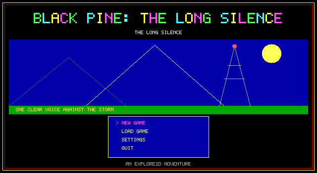
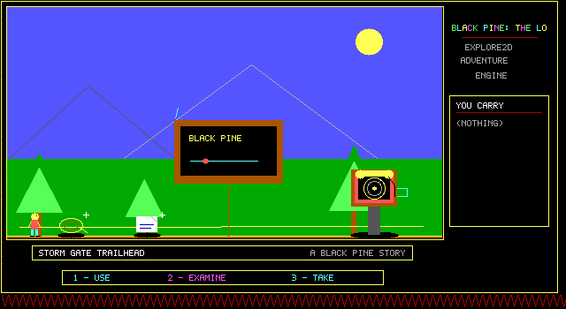
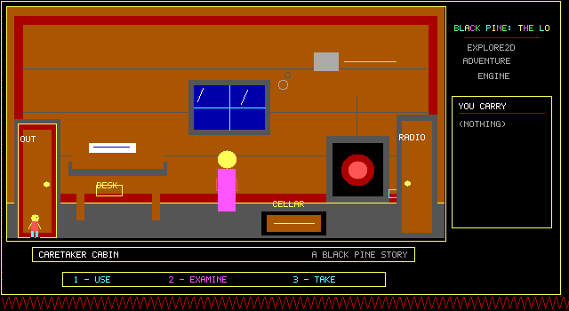
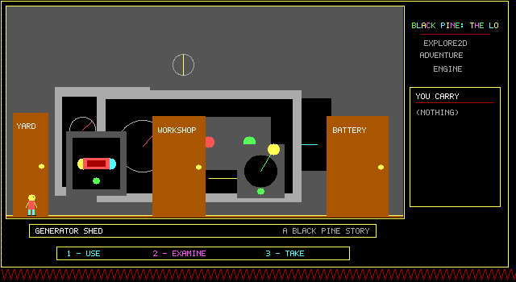
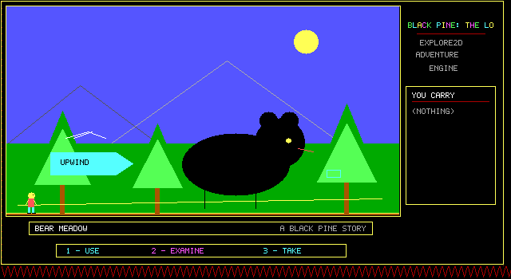
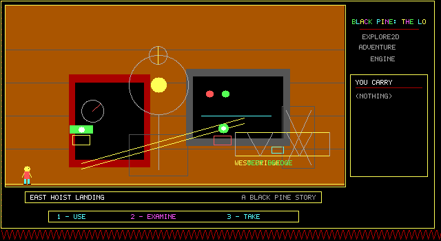

# Black Pine

> **Development status:** Black Pine is still in active development. Its full
> 124-screen main route is playable end to end, but the game is unfinished and
> the final two regions still need their human-playability and visual-authoring
> passes. Current builds may contain bugs or progression problems.

Black Pine: The Long Silence is an original full-length C++23 exploration and
puzzle adventure for the **Explore2D** engine. It expands the original vertical
slice into 124 fixed, non-scrolling screens and a five-act story that can be
played from the storm gate to the summit transmitter.

No Tajná mise rooms, story, dialogue or art are reused.

## Premise

A storm has knocked the Black Pine mountain radio relay off the air and forced
rescue helicopter Kestrel Six down beyond the ridge. Technician Iris Bell first
repairs the local relay, then discovers that Gideon Voss deliberately revived
Nightjar's dangerous Quiet Field. The investigation crosses forest, quarry,
logging railway, dam, mine, observatory, bunker and summit tower before Iris can
invert the field and reopen the emergency network.

## Screenshots

All screenshots below are captured directly from the current Explore2D
renderer at its native 640×350 virtual resolution.

| | |
|---|---|
| <br>*Title screen and main menu* | <br>*The journey begins at Storm Gate Trailhead* |
| <br>*Searching Mara's caretaker cabin* | <br>*The repaired relay generator* |
| <br>*A dangerous encounter in the north forest* | <br>*The quarry hoist after restoration* |

## Implemented game scope

- Exactly 124 fixed connected locations with ordinary place names, plus title, settings, map,
  help, death and ending states.
- Ten visually distinct code-drawn regions and 17 travel-map anchors.
- Exactly 64 inventory records: 56 functional tools, components and clues plus
  eight optional keepsakes.
- USE / EXAMINE / TAKE.
- Main characters Mara, Theo, Nell, Owen, Lila, June, Jonah, Sable, Miriam
  Kline, Gideon Voss and dispatcher Elias, with anchored dialogue bubbles.
- Multi-region repairs, rescues, investigation, non-combat patrol solutions,
  environmental hazards and persistent revisits.
- A generator repair requiring fuse, cable, battery, fuel and feeder isolation;
  a logging-engine rebuild; dam drainage; mine and lift power routing;
  observatory infiltration; and the Nightjar shutdown sequence.
- A final summit assembly using grounding, phase coil, prism, calibration fork,
  beacon reference, antenna alignment and protected sequence `4-1-3`.
- Three successful epilogues: Carrier Restored, evidence-bearing Open Channel,
  and the completionist Keeper of Black Pine.
- Visited-location fast travel.
- Twelve designed hazard families with readable warning states.
- Save/load through the Explore2D host.
- A configurable code-drawn title/menu screen before play begins.
- 124 original procedural scenes using only the fixed 16-colour EGA palette.
- Persistent code-drawn state overlays for completed repairs and activated
  machinery, including the generator chain, pumps, lift, Nightjar systems and
  summit transmitter.
- Selective low-bandwidth two-frame motion tied to water, weather, people,
  wildlife, signals and machinery; static scenery deliberately remains still.
- Monophonic QBasic/PC-speaker-style cues for menu, movement actions, pickups,
  repairs, warnings, death, save/load and victory, played through CNA.
- Entirely procedural runtime graphics; the PNG screenshots are documentation
  captures rather than game art assets.
- Complete English and Czech localization for the current game, including
  menus, settings, room and hotspot names, inventory, descriptions, dialogue,
  system feedback, hazards and ending text.
- Context-sensitive F1 help that follows the actual puzzle state and suggests
  the next required action without changing progress.

## Build

The project expects Explore2D next to it by default:

```text
parent/
  explore-2d/
  black-pine/
```

Then configure against a **complete CNA checkout** (including its required
third-party/submodule content):

```bash
cmake -S black-pine -B black-pine/build \
  -DCNA_SOURCE_DIR=/path/to/cna
cmake --build black-pine/build -j
./black-pine/build/black-pine
```

If Explore2D is elsewhere:

```bash
-DEXPLORE2D_SOURCE_DIR=/path/to/explore-2d
```

For a headless rules-only build/test, CNA is unnecessary:

```bash
cmake -S . -B build-core \
  -DEXPLORE2D_BUILD_CNA=OFF \
  -DBLACK_PINE_BUILD_TESTS=ON
cmake --build build-core -j
ctest --test-dir build-core --output-on-failure
```

The scenario test scripts the complete five-act puzzle chain through the
evidence-broadcast victory and renders representative rooms from all ten visual
regions.

### Web build

With the Emscripten SDK installed, build the browser version using the checked
in preset and wrapper:

```bash
./scripts/build-web.sh
python3 -m http.server 8080 --directory build-web-emscripten
```

Open `http://localhost:8080/black-pine.html`. The wrapper locates the local SDK
when possible, sets the additional `EMSCRIPTEN` variable required by CNA's
Draco dependency, disables an unusable system `ccache`, and verifies that the
HTML, JavaScript and WebAssembly outputs are non-empty. The project CMake also
supplies the `<algorithm>` include omitted by CNA's bundled Draco revision when
that target is compiled by recent Emscripten versions and links with the same
WebAssembly exception mode used by CNA. The CNA checkout itself is not modified.
The generated page uses Black Pine's own 1280×700 pixel-perfect shell rather
than Emscripten's generic demonstration page, matching the native CNA window.

## Controls

| Key | Action |
|---|---|
| Left / Right | turn or walk |
| Up | cycle USE / EXAMINE / TAKE |
| Down | perform selected verb |
| 1 | USE |
| 2 | EXAMINE |
| 3 | TAKE |
| Enter / Space | contextual action, otherwise jump |
| M | travel to a discovered anchor |
| S / L | save / load |
| F11 | toggle window / fullscreen |
| F1 | show or close the context-sensitive next-step hint |
| Q | quit |
| Up / Down + Enter | choice/map navigation |
| Escape | pause from the world; cancel/back in choices and menus |
| Left / Right in Settings | change language |

Black Pine inherits Explore2D's fixed 640×350 display, room/inventory/action
layout and palette. Its mountain, forest, quarry, railway, waterworks, mine,
laboratory, bunker and tower artwork consists only of code-defined EGA
primitives in `BlackPineFullWorld.cpp`; the canonical 124-screen catalogue lives
in `BlackPineContent.hpp`.

## Language settings

Choose **Settings** on the title screen to switch between English and Czech.
During play, press **Escape**, choose **Settings**, and change the language
without restarting or altering the current game state. Explore2D stores the
preference in `black-pine.e2dsettings` and restores it on the next launch.

English is the canonical fallback. Czech is supplied as UTF-8 text and rendered
by Explore2D's code-drawn bitmap font, including Czech diacritics. The
pre-production `docs/GAME_DESIGN.md` intentionally remains English-only.

## Playing and navigation

Every room is presented only by its ordinary place name; catalogue numbers are
internal design references and never appear in the scene artwork or F1 help.
Left and right follow outdoor paths, while visible doors, hatches and ladders
use ENTER to connect authored interior branches; important milestones become map anchors. Several
puzzles deliberately require returning to earlier equipment—for example, the
generator can only start after downstream battery, fuel and transformer work,
and the observatory dome key is found beyond the dome itself.

The game intentionally does not print a full item-by-item solution in its HUD;
EXAMINE, conversations and revisiting locations are expected to matter.

If you become stuck, press **F1**. Explore2D pauses the action and Black Pine
selects the highest-priority unfinished objective whose conditions match the
current session. The hint is localized and closes with F1, Enter, or Escape.

Automated story completeness and human-readable playability are tracked
separately in [`docs/PLAYABILITY_AUDIT.md`](docs/PLAYABILITY_AUDIT.md).

## License

Black Pine is available under the [MIT License](LICENSE).
