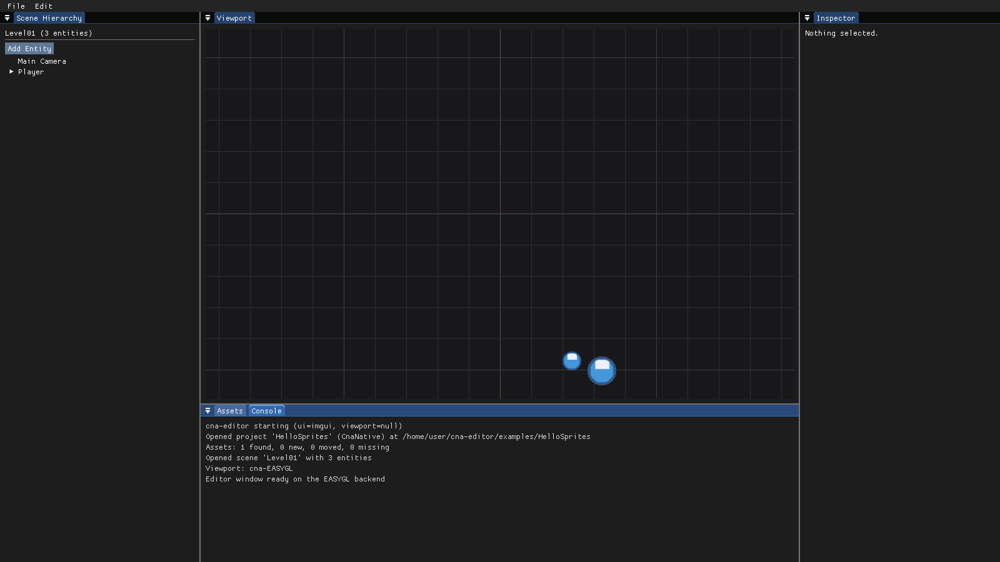

# CNA Editor

Editor, asset pipeline and tooling for [CNA](https://github.com/openeggbert/cna) — the C++
reimplementation of the XNA 4.0 framework.

> **Status: it opens and it draws.** Built against a real CNA checkout, `cna-editor` opens a
> window, docks its seven panels, and renders them entirely through CNA's *public* API — no
> internal headers, no authored shader, no per-backend renderer. The **`cna-player` process** is
> launched by the editor over a real socket. The document model, undo system, asset database and
> project format are implemented and tested.
>
> The default build stays dependency-free: no CNA checkout, no GPU, no window, 98 tests in about a
> second. What is missing is the *scene* viewport's own drawing — [`plan.md`](plan.md) Phase 1.



---

## The idea

CNA Editor is **not** a new engine, and it is not part of CNA. It is a set of tools *on top of*
CNA, built against the same public API a game uses:

- a **document editor** — scenes, entities, components, undo;
- an **asset pipeline** — stable ids, importers, dependency tracking;
- a **runtime bridge** — play mode in a separate `cna-player` process;
- a **plugin SDK** — importers, component types, panels, gizmos, exporters.

That framing is the whole design. CNA stays a lightweight XNA-compatible framework you can use with
no editor at all, while projects that want a modern workflow can opt into one. A project declares
which it is:

| Project kind | What the editor offers |
|--------------|------------------------|
| `CnaNative` | Scenes, entities, components, inspector, gizmos, prefabs, play mode, a 2D and a 3D viewport |
| `XnaCompatible` | Asset browser, importer settings, content preview, backend configuration, Play — and nothing else. The game keeps its own `Initialize`/`LoadContent`/`Update`/`Draw` |

A pure XNA port is never forced through the entity model to use the tooling.

---

## Build

The default build has **no external dependencies** — no CNA checkout, no GPU, no window:

```bash
cmake -S . -B build
cmake --build build -j
ctest --test-dir build --output-on-failure
```

Requires a C++23 compiler (GCC 13+, Clang 16+, MSVC 19.38+) and CMake ≥ 3.20.

Try it against the bundled example project:

```bash
./build/cna-editor --headless --project=examples/HelloSprites/HelloSprites.cnaproject
```

```
[info] cna-editor starting (ui=null, viewport=null)
[info] Opened project 'HelloSprites' (CnaNative) at .../examples/HelloSprites
[info] Assets: 1 found, 1 new, 0 moved, 0 missing
[info] Opened scene 'Level01' with 3 entities
```

### Building with the CNA viewport

The CNA-backed viewport is opt-in, because CNA needs two sibling checkouts:

```bash
cd ..
git clone https://github.com/openeggbert/cna.git
git clone https://github.com/openeggbert/sharp-runtime.git
cd cna-editor

cmake -S . -B build-cna -DCNA_EDITOR_WITH_CNA=ON -DCNA_DEVICES=ON
cmake --build build-cna -j

# Opens a real window with the editor in it.
./build-cna/cna-editor --project=examples/HelloSprites/HelloSprites.cnaproject
```

CNA itself needs SDL3's build dependencies (on Debian/Ubuntu: `libx11-dev libxext-dev
libxrandr-dev libxcursor-dev libxi-dev libxfixes-dev libxss-dev libxtst-dev libxkbcommon-dev
libwayland-dev wayland-protocols libdecor-0-dev`) plus FFmpeg headers (`libavcodec-dev
libavformat-dev libavutil-dev libswresample-dev`). `-DCNA_DEVICES=ON` is what gives the editor a
working clipboard.

To prove it drew something without looking at it — which is what CI does:

```bash
SDL_VIDEODRIVER=dummy ./build-cna/cna-editor \
    --project=examples/HelloSprites/HelloSprites.cnaproject \
    --frames=20 --screenshot=editor.png
# cna-editor: backend SOFTWARE, 56 frames, 1600x900 display, 14 draw calls, 1858 triangles,
#             1 textures created, 0 texture updates, 0 commands clipped away
```

### Command-line options

| Option | Meaning |
|--------|---------|
| `--project=PATH` | Open this `.cnaproject` at start-up |
| `--scene=PATH` | Open this `.cnascene`, overriding the project's startup scene |
| `--view=2d\|3d` | Which viewport camera to start in. Defaults to `2d` |
| `--headless` | Run with no window, on the null UI |
| `--frames=N` | Exit after N frames |
| `--screenshot=PATH` | Write a PNG of the final frame. Needs `--frames` |
| `--compare-backends` | Compare every installed player build and exit non-zero when they differ |
| `--tolerance=N` | How close two backends' pixels have to be to count as the same |
| `--autosave=SECONDS` | How often to write a `.cnarecovery` snapshot of unsaved work |
| `--list-backends` | Print the backends this build knows about |

### Build options

| Option | Default | Meaning |
|--------|:-------:|---------|
| `CNA_EDITOR_WITH_CNA` | `OFF` | Build the CNA-backed viewport, UI renderer and input platform |
| `CNA_EDITOR_WITH_IMGUI` | `ON` | Build the Dear ImGui UI (vendored; no system dependencies) |
| `CNA_EDITOR_BUILD_TESTS` | `ON` | Build the test suite |
| `CNA_EDITOR_WARNINGS_AS_ERRORS` | `OFF` | `-Werror` / `/WX` |
| `CNA_EDITOR_CNA_ROOT` | `../cna` | Where to find the CNA checkout |
| `CNA_EDITOR_PLAYER_BACKENDS` | *(empty)* | Extra backends to build `cna-player` for, e.g. `SOFTWARE;EASYGL`. Each is a full CNA build |

### More than one backend

CNA fixes its graphics backend at compile time, so "run this on Software as well" means "build a
second `cna-player`". `CNA_EDITOR_PLAYER_BACKENDS` does that: one nested build per backend, each
producing a `cna-player-<backend>` beside the editor, which is where discovery looks.

```bash
cmake -S . -B build-cna -DCNA_EDITOR_WITH_CNA=ON \
    -DCNA_GRAPHICS_BACKEND=EASYGL -DCNA_EDITOR_PLAYER_BACKENDS="SOFTWARE"
cmake --build build-cna -j

# Play mode now offers both, and the comparison has something to compare.
./build-cna/cna-editor --compare-backends \
    --project=examples/HelloSprites/HelloSprites.cnaproject
# cna-editor: backend comparison against 'easygl'
#   software
#       496 of 921600 pixels differ, largest channel difference 64
# cna-editor: the backends do not agree.   (exit 5)
```

It is minutes per backend, not seconds — each one compiles CNA again — which is why the list is
empty by default. `--tolerance=N` sets how large a per-channel difference still counts as the same
picture; two backends are never bit-identical, so the useful question is always "different enough
to matter".

---

## There is no `--graphics` option

CNA selects its graphics backend **at compile time**. `cmake/BackendSelection.cmake` bakes exactly
one `CNA_BACKEND_*` definition per build, and `CNA::getCurrentGraphicsBackendType()` is `constexpr`.
One CNA build contains one backend, with no runtime registry and no way to load a second.

So an editor binary is permanently bound to the backend it was compiled against, and `--graphics`
on the editor would be a lie. It is rejected with an explanation rather than silently ignored.

To preview a game on a different backend, launch the matching player build:

```bash
cna-player --project=MyGame.cnaproject --graphics=software --editor-port=34781
```

This is also why play mode is a separate process (see below), and it is what makes backend
comparison mode natural rather than exotic.

Run `cna-editor --list-backends` to see the 14 backends and how each is classified:

| Tier | Backends |
|------|----------|
| **Editor Supported** — can host the editor UI | EASYGL, VULKAN, SDL_RENDERER, BGFX, SDL_GPU, D3D11, D3D12 |
| **Preview Only** — fine for a player, not for a UI | WEBGPU, D3D9, SOFTWARE |
| **Runtime Only** — ships games only | CANVAS, ASCII, DX3, HEADLESS |

---

## Architecture at a glance

```
┌─────────────────────────── cna-editor ────────────────────────────┐
│  Hierarchy      Viewport            Inspector                     │
│  Assets         Console                                           │
└───────────────────────────────────────────────────────────────────┘
                             │
        ┌────────────────────┴────────────────────┐
        ▼                                         ▼
 cna-editor-ui-imgui                      cna-editor-context
 (Dear ImGui)                             (project, scene, registry,
        │                                  assets, undo, selection)
        │  UiDrawData  ▼   ▲  UiInputState
        └──────────────┬───┴──────────────┐
                       ▼                  │
             cna-editor-viewport ──────────┘
             ← the ONLY module that links CNA
               · CnaUiRenderer   (draws the UI)
               · CnaUiPlatform   (mouse/keys/text)
               · CnaEditorViewport (draws the scene)

        ┌────────────────────┬────────────────────┐
        ▼                    ▼                    ▼
 cna-editor-scene    cna-editor-assets    cna-editor-project
        └────────────────────┼────────────────────┘
                             ▼
                      cna-editor-core
              (Uuid · JSON · PropertyValue ·
           ComponentDescriptor · CommandHistory)

 cna-editor-plugins    cna-editor-runtime-bridge    cna-editor-player
 (manifest, loading)   (protocol, TCP, spawn) ─IPC─▶ (cna-player process)
```

Everything except `cna-editor-viewport` is CNA-free. That is enforced by the build graph, not by
review: a stray `#include <Microsoft/Xna/...>` elsewhere fails to compile.

The UI is joined to CNA by two plain data types rather than by an interface — `UiDrawData` carries
geometry out, `UiInputState` carries input in. So `CnaUiRenderer.cpp` contains **no ImGui header**,
and "the editor UI renders through CNA's public API" is a property of the build graph rather than a
claim to re-check by hand.

### Six things worth knowing

**Undo is a hard rule.** Every document mutation is an `EditorCommand` pushed through
`CommandHistory` — from the inspector, from a gizmo, from a plugin, from the bridge. Retrofitting
undo is the mistake that cannot be repaired incrementally: by the time you notice, every call site
is a place undo silently does not work. Continuous input merges, so a gizmo drag is one undo step
that returns to where the drag started.

**Reflection is hand-written.** C++ has none, so `ComponentDescriptor` supplies it. The inspector,
the serialiser and `SetPropertyCommand` are all generic over it — including for component types
supplied by a plugin the editor was never compiled against. A scene using a component whose plugin
failed to load still round-trips through save and load with nothing lost.

**Assets are referenced by id, never by path.** Every asset gets a UUID in a `.cnaasset` sidecar.
Moving `Assets/player.png` into `Assets/Characters/` touches no scene and breaks no reference — a
one-line diff instead of a hundred-line one.

**Play mode is a separate process.** Structurally required, not merely prudent: the editor and the
game are linked against different CNA builds and cannot share an address space. A game crash also
cannot take the editor down, and historical or 32-bit builds become testable.

**The UI toolkit is behind an abstraction.** No panel calls Dear ImGui directly. That keeps the
choice reversible, makes the panel layer testable with no display, and keeps plugins working across
a toolkit change.

**The editor's UI is drawn with the same API a game has.** `CnaUiRenderer` uses
`DrawUserIndexedPrimitives`, `BasicEffect`, `Texture2D`, `RasterizerState::ScissorTestEnable`,
`BlendState::NonPremultiplied` — no `CNA::Internal::*`, no authored shader, no per-backend code.
One implementation serves every backend. If CNA could not draw the editor's UI, that would be a gap
in CNA worth finding; two small ones were, and are filed in
[`docs/SPIKE-IMGUI-CNA.md`](docs/SPIKE-IMGUI-CNA.md).

---

## Repository layout

```
cna-editor/
├── ANALYSIS.md              Architecture analysis, findings, and the 15 decisions
├── plan.md                  Phased task plan, ED-NNN ids
├── docs/
│   ├── FORMATS.md           .cnaproject / .cnascene / .cnaasset / wire protocol
│   └── SPIKE-IMGUI-CNA.md   Can ImGui render through CNA's public API? (yes)
├── include/CNA/Editor/      Public headers
│   ├── Core/                Uuid, Json, EditorMath, PropertyValue,
│   │                        ComponentDescriptor, EditorCommand
│   ├── Scene/               EditorEntity, SceneDocument, SceneCommands, BuiltinComponents
│   ├── Assets/              AssetDatabase
│   ├── Project/             Project, backend capability table
│   ├── Ui/                  EditorUi, NullEditorUi, ImGuiEditorUi,
│   │                        UiDrawData, UiInputState
│   ├── Viewport/            EditorViewport, CnaUiRenderer, CnaUiPlatform
│   ├── Plugins/             Plugin manifest and host
│   ├── RuntimeBridge/       EditorProtocol, MessageChannel, PlayerProcess
│   ├── Player/              PlayerHost
│   ├── EditorContext.hpp
│   └── EditorApplication.hpp
├── src/                     One directory per module
├── third_party/imgui/       Dear ImGui 1.92.9b, core only
├── tests/                   96 tests, no third-party framework
└── examples/HelloSprites/   A project the editor opens end to end
```

---

## Contributing

Read [`ANALYSIS.md`](ANALYSIS.md) before proposing an architectural change — most of the obvious
alternatives are already recorded there with the reason they were rejected.

House rules, matching CNA's own:

- C++23, `-Wall -Wextra -Wpedantic` clean.
- `// SPDX-License-Identifier: MS-PL` at the top of every file.
- Doxygen `@brief` on every public type and method.
- Every document mutation goes through an `EditorCommand`.
- Only `cna-editor-viewport` may include CNA headers.
- New behaviour comes with a test. The suite runs headless in about a second — there is no excuse.
- The UI layer talks to `UiDrawData`/`UiInputState`, never straight to a toolkit or to CNA.

---

## Licence

Microsoft Public License (Ms-PL), matching CNA. See [`LICENSE`](LICENSE).
